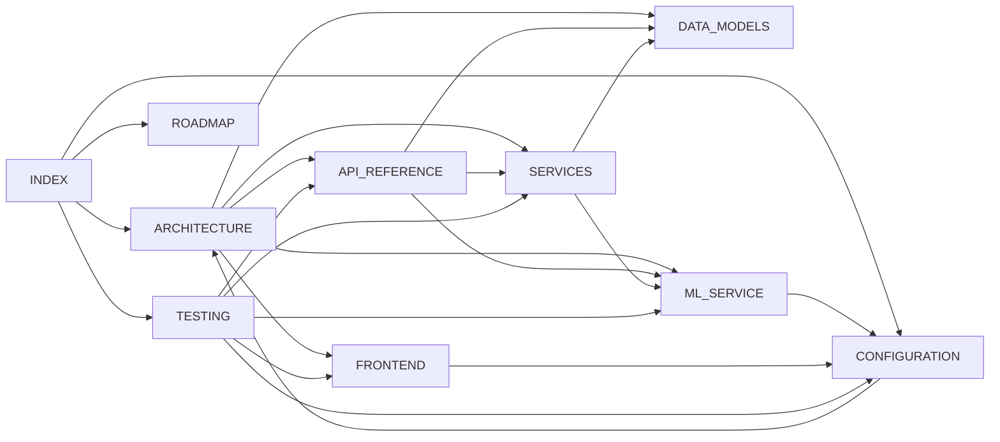

# FinControl - Documentación

> [!abstract] Aplicación personal de análisis financiero
> Dashboard interactivo, simulador hipotecario, predicciones con IA y análisis de escenarios what-if.

---

## Mapa de Documentación

```
                    ┌─────────────┐
                    │   INDEX     │  ◄── Estás aquí
                    └──────┬──────┘
           ┌───────────────┼───────────────┐
           ▼               ▼               ▼
    ┌─────────────┐ ┌─────────────┐ ┌─────────────┐
    │ ARCHITECTURE│ │   ROADMAP   │ │CONFIGURATION│
    │  Visión     │ │  Fases y    │ │  Docker,    │
    │  general    │ │  progreso   │ │  env vars   │
    └──────┬──────┘ └─────────────┘ └──────┬──────┘
           │                               │
     ┌─────┼─────────────┬─────────────┐   │
     ▼     ▼             ▼             ▼   ▼
┌─────────┐ ┌───────────┐ ┌──────────┐ ┌───────┐
│   API   │ │   DATA    │ │ SERVICES │ │TESTING│
│REFERENCE│ │  MODELS   │ │  Lógica  │ │ 321   │
│Endpoints│ │  Esquemas │ │ negocio  │ │ tests │
└─────────┘ └───────────┘ └──────────┘ └───────┘
                               │
                    ┌──────────┼──────────┐
                    ▼                     ▼
             ┌─────────────┐      ┌─────────────┐
             │ ML_SERVICE  │      │  FRONTEND   │
             │ DistilBERT  │      │  SvelteKit  │
             │ LSTM        │      │  Skeleton   │
             └─────────────┘      └─────────────┘
```

---

## Documentos

### Fundamentos

| Documento | Descripción |
|---|---|
| [[ARCHITECTURE\|Arquitectura del Sistema]] | Visión general, stack tecnológico, diagrama de componentes, modelo de datos, endpoints, estrategia ML |
| [[ROADMAP\|Roadmap de Desarrollo]] | 7 fases del proyecto con checkboxes de progreso. Fases 1-4 completadas + Fase 5.1 |
| [[CONFIGURATION\|Configuración y Despliegue]] | Variables de entorno, Docker Compose (7 servicios), Dockerfiles, Alembic, Ruff, desarrollo local |

### Referencia Técnica

| Documento | Descripción |
|---|---|
| [[API_REFERENCE\|Referencia de API]] | Todos los endpoints REST bajo `/api/v1/`. Request/response JSON, query params, códigos de estado |
| [[DATA_MODELS\|Modelos de Datos]] | 10 modelos SQLAlchemy con columnas, tipos, constraints, relaciones. Diagrama ER. 6 migraciones Alembic |
| [[SERVICES\|Capa de Servicios]] | 13 servicios + 4 módulos de utilidades + tareas Celery. Algoritmos, fórmulas, grafos de dependencias |

### Subsistemas

| Documento | Descripción |
|---|---|
| [[ML_SERVICE\|Servicio ML]] | Microservicio FastAPI + PyTorch. DistilBERT (categorización), LSTM bidireccional (forecasting), Prophet (fallback). Pipeline de reentrenamiento |
| [[FRONTEND\|Frontend]] | SvelteKit + Skeleton UI v2 + Tailwind. API client con refresh mutex, auth guard, stores reactivos |

### Calidad

| Documento | Descripción |
|---|---|
| [[TESTING\|Guía de Testing]] | 321 tests (228 backend + 68 ML + 25 frontend). Patrones, fixtures, mocks, cobertura |

---

## Relaciones entre Documentos



---

## Estado del Proyecto

| Fase | Nombre | Estado |
|---|---|---|
| 1.1 | Infraestructura Base | ✅ Completada |
| 1.2 | Autenticación JWT | ✅ Completada |
| 1.3 | Modelos Core (Accounts, Categories, Transactions) | ✅ Completada |
| 1.4 | Importación CSV | ✅ Completada |
| 2.1 | Presupuestos y Alertas | ✅ Completada |
| 2.2 | Inversiones | ✅ Completada |
| 2.3 | Dashboard Analytics | ✅ Completada |
| 2.4 | Simulador Hipotecario | ✅ Completada |
| 2.5 | Fiscalidad (IRPF) | ✅ Completada |
| 3.1 | Infraestructura ML | ✅ Completada |
| 3.2 | Categorización DistilBERT | ✅ Completada |
| 3.3 | Reentrenamiento Automático | ✅ Completada |
| 4.1 | Predicción Cashflow (LSTM) | ✅ Completada |
| 4.2 | Escenarios What-if | ✅ Completada |
| 4.3 | AI Affordability Hipotecario | ✅ Completada |
| 5.1 | Frontend Base (SvelteKit) | ✅ Completada |
| 5.2–5.8 | Dashboard, Gráficos, Vistas | 🔲 Pendiente |
| 6 | Optimización y Caché | 🔲 Pendiente |
| 7 | Producción y CI/CD | 🔲 Pendiente |

> [!tip] Detalles completos
> Ver [[ROADMAP|Roadmap de Desarrollo]] para el desglose de tareas por fase.

---

## Stack Tecnológico

| Capa | Tecnología |
|---|---|
| **Backend** | Python 3.12, FastAPI, SQLAlchemy 2.0 async, Alembic |
| **Frontend** | SvelteKit 2.12.1, Svelte 4, Skeleton UI v2, Tailwind CSS 3 |
| **ML** | PyTorch 2.7, DistilBERT, LSTM, Prophet, scikit-learn |
| **BD** | PostgreSQL 16, Redis 7 |
| **Tareas** | Celery 5.4 + Redis (broker/backend) |
| **Infra** | Docker Compose, Nginx |

> [!info] Detalle completo
> Ver [[ARCHITECTURE#2. Stack Tecnológico|Arquitectura → Stack Tecnológico]] para justificaciones de cada elección.
