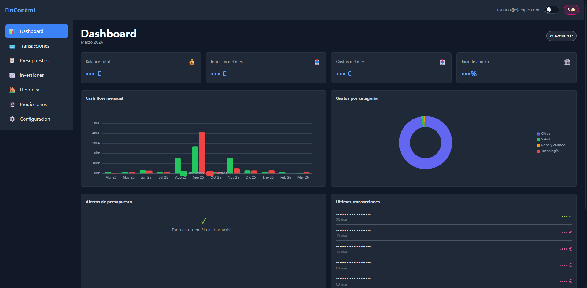
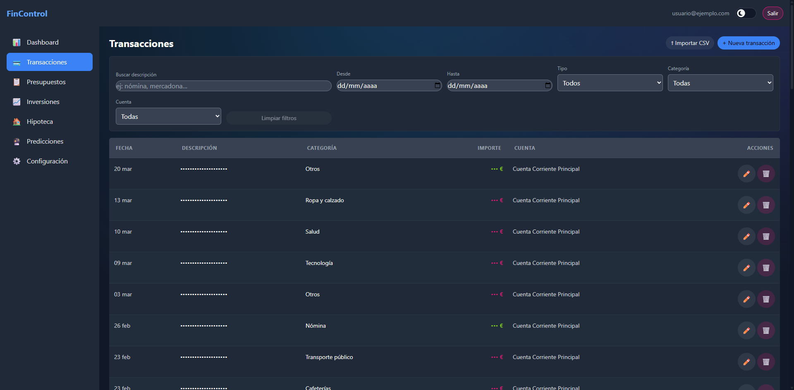
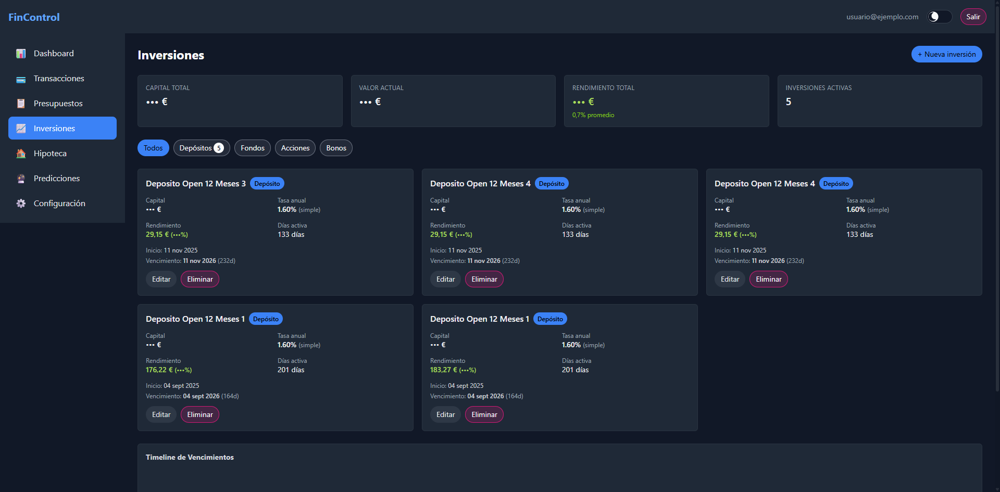
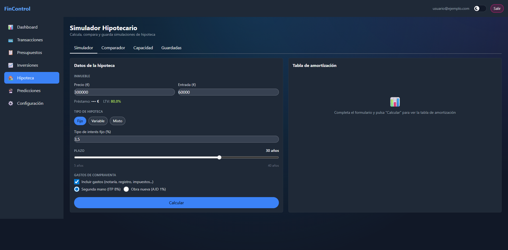
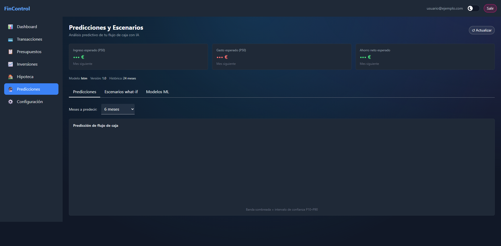
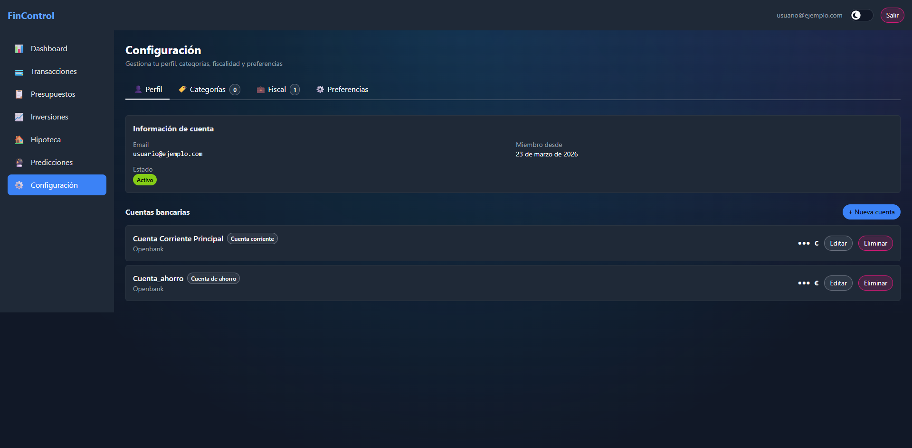

# FinControl

> Aplicación personal de análisis financiero con dashboard interactivo, categorización automática con IA, simulador hipotecario avanzado y predicciones de flujo de caja.

[](https://github.com/tu-usuario/fincontrol/actions/workflows/ci.yml)
[](https://www.python.org/)
[](https://kit.svelte.dev/)
[](LICENSE)
[](https://docs.docker.com/compose/)

---

## Screenshots

| Dashboard | Transacciones |
|-----------|--------------|
|  |  |

| Inversiones | Simulador Hipotecario |
|-------------|----------------------|
|  |  |

| Predicciones y Escenarios IA | Configuración |
|-----------------------------|--------------|
|  |  |

---

## Características

### Gestión financiera
- Registro de ingresos, gastos y cuentas bancarias
- Importación de extractos CSV (formato OpenBank) con deduplicación automática
- Presupuestos mensuales por categoría con alertas configurables
- Gestión de inversiones: depósitos, fondos, acciones y bonos

### Inteligencia Artificial
- Categorización automática de transacciones con DistilBERT (multilingüe)
  - Auto-asigna si confianza > 85%, sugiere si > 50%
  - Feedback inline → reentrenamiento incremental semanal vía Celery Beat
- Predicción de flujo de caja a 3-12 meses con LSTM bidireccional
  - Intervalos de confianza P10/P50/P90 (MC Dropout)
  - Fallback automático a Prophet si el LSTM no está disponible

### Simulador hipotecario
- Tipos: fijo, variable (Euríbor + diferencial) y mixto
- Tabla de amortización completa (sistema francés)
- Cálculo TAE, gastos de cierre (notaría, ITP/AJD, gestoría)
- Comparador hasta 3 escenarios simultáneos
- Capacidad máxima de hipoteca basada en ingresos reales
- Asesor hipotecario con IA: stress test Euríbor + predicción ML

### Análisis fiscal y escenarios
- Cálculo IRPF 2025/2026 con tramos actualizados (bruto → neto)
- Motor de escenarios "what-if": ±sueldo, ±Euríbor, gastos recurrentes
- Simulación Monte Carlo con distribución P10/P50/P90
- Integración IRPF ↔ hipoteca ↔ predicción ML

---

## Stack tecnológico

| Capa | Tecnología |
|------|-----------|
| **Backend** | Python 3.12 · FastAPI · SQLAlchemy 2.0 (async) · Alembic · Celery + Redis |
| **Frontend** | SvelteKit 2 · TypeScript · Apache ECharts · Skeleton UI v2 · Tailwind CSS 3 |
| **Base de datos** | PostgreSQL 16 · Redis 7 |
| **ML / IA** | PyTorch · DistilBERT · LSTM bidireccional · Prophet · NumPy · SciPy |
| **Infraestructura** | Docker Compose · Nginx (SSL local con mkcert) · GitHub Actions CI |

---

## Requisitos previos

| Herramienta | Versión mínima | Notas |
|-------------|---------------|-------|
| Docker Desktop | 4.x | Incluye Docker Compose v2 |
| Git | 2.x | |
| GPU NVIDIA + CUDA | (opcional) | Para ML acelerado; CPU funciona pero es más lento |
| mkcert | 1.4.x | Solo para despliegue de producción local con SSL |

---

## Inicio rápido (desarrollo)

```bash
# 1. Clonar el repositorio
git clone https://github.com/tu-usuario/fincontrol.git
cd fincontrol

# 2. Configurar variables de entorno
cp .env.example .env
# Edita .env si necesitas cambiar contraseñas o puertos

# 3. Levantar todos los servicios
docker compose -f docker-compose.dev.yml up --build
```

Una vez arrancado, abre:

| Servicio | URL |
|---------|-----|
| Frontend | http://localhost:3000 |
| Backend API + Swagger | http://localhost:8000/docs |
| ML Service + Swagger | http://localhost:8001/docs |

El primer arranque descarga los pesos de DistilBERT (~260 MB) y entrena el modelo inicial; puede tardar varios minutos.

---

## Estructura del proyecto

```
fincontrol/
├── backend/                # API REST (FastAPI)
│   ├── app/
│   │   ├── api/v1/         # Endpoints: auth, accounts, transactions, ...
│   │   ├── models/         # Modelos SQLAlchemy
│   │   ├── schemas/        # Schemas Pydantic
│   │   ├── services/       # Lógica de negocio
│   │   ├── tasks/          # Tareas Celery
│   │   └── utils/          # Amortización, Monte Carlo, CSV parser
│   └── tests/              # Tests pytest (>80% cobertura)
├── frontend/               # Cliente SvelteKit
│   ├── src/
│   │   ├── routes/         # Páginas: dashboard, transactions, ...
│   │   ├── lib/            # Stores, cliente API, componentes
│   └── tests/e2e/          # Tests E2E Playwright
├── ml-service/             # Microservicio ML (FastAPI, puerto 8001)
│   ├── app/ml/             # DistilBERT, LSTM, Prophet, preprocessor
│   ├── data/               # Dataset sintético, generador series temporales
│   └── scripts/            # Entrenamiento, evaluación, etiquetado
├── nginx/                  # Configuración Nginx (producción)
├── scripts/                # pg-backup.sh, generate-certs.sh
├── Docs/                   # Documentación técnica detallada
├── docker-compose.dev.yml  # Orquestación desarrollo
├── docker-compose.yml      # Orquestación producción
└── .env.example            # Variables de entorno de ejemplo
```

---

## Documentación

| Documento | Descripción |
|-----------|-------------|
| [Arquitectura](Docs/ARCHITECTURE.md) | Stack, modelo de datos, flujo de requests, estrategia ML |
| [Referencia API](Docs/API_REFERENCE.md) | Todos los endpoints REST con ejemplos request/response |
| [Modelos de datos](Docs/DATA_MODELS.md) | Esquemas de BD, columnas y relaciones |
| [Capa de servicios](Docs/SERVICES.md) | Lógica de negocio y algoritmos financieros |
| [Servicio ML](Docs/ML_SERVICE.md) | DistilBERT, LSTM, feedback loop, reentrenamiento |
| [Frontend](Docs/FRONTEND.md) | SvelteKit, stores, auth flow, componentes |
| [Despliegue](Docs/DEPLOYMENT.md) | Guía de instalación paso a paso (dev y producción) |
| [Testing](Docs/TESTING.md) | Patrones de tests, cobertura, E2E |
| [Configuración](Docs/CONFIGURATION.md) | Variables de entorno, Docker, dependencias |
| [Roadmap](Docs/ROADMAP.md) | Plan de desarrollo y fases completadas |

La API REST también está auto-documentada con Swagger/OpenAPI interactivo en **`http://localhost:8000/docs`** (backend) y **`http://localhost:8001/docs`** (ML service).

---

## Comandos de desarrollo

```bash
# Tests backend (con cobertura)
docker compose -f docker-compose.dev.yml exec backend pytest --cov=app -v

# Lint Python (Ruff)
docker compose -f docker-compose.dev.yml exec backend ruff check app/
docker compose -f docker-compose.dev.yml exec backend ruff format app/

# Lint y formato frontend
cd frontend && npm run lint
cd frontend && npm run format

# Tests E2E (Playwright)
cd frontend && npm run test:e2e

# Migraciones Alembic
docker compose -f docker-compose.dev.yml exec backend alembic revision --autogenerate -m "descripcion"
docker compose -f docker-compose.dev.yml exec backend alembic upgrade head
```

---

## Despliegue en producción

Consulta la [Guía de Despliegue](Docs/DEPLOYMENT.md) para instrucciones detalladas de:
- Configuración SSL local con mkcert
- `docker compose up` (producción, sin puertos expuestos directamente)
- Backups automáticos de PostgreSQL
- Health checks y monitorización

---

## Contribuir

Las contribuciones son bienvenidas. Lee [CONTRIBUTING.md](CONTRIBUTING.md) para el flujo de trabajo, estándares de código y cómo reportar bugs o proponer features.

---

## Licencia

Distribuido bajo la licencia [MIT](LICENSE).
